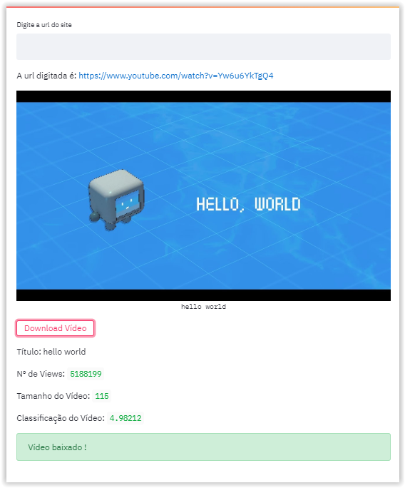

# TESTES DE DOWNLOAD DE VÍDEOS
[TESTE AQUI](https://gl-download-youtube.herokuapp.com/)

## BIBLIOTECA:
- [Pytube](https://python-pytube.readthedocs.io/en/latest/index.html)
- [Streamlit](https://www.streamlit.io/)

## TUTORIAL:
- [Building a YouTube Downloader with Python](https://codeout.tech/tutorial/python/youtube-downloader.html)
- [Building a Simple UI with Python](https://towardsdatascience.com/building-a-simple-ui-for-python-fd0e5f2a2d8b)

### TO DO:
- Ajustar opção de download para salvar o arquivo na máquina do usuário
